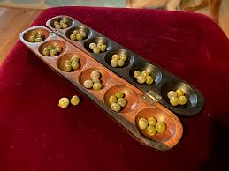
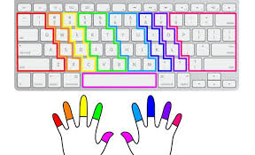
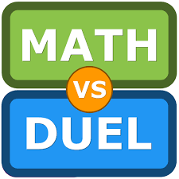
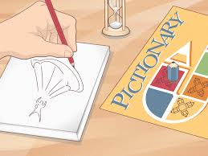
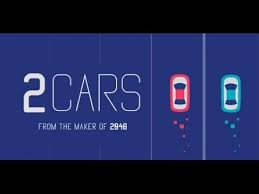
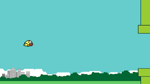

# 🎡 Pulsar Funhouse

A playful web app inspired by [neal.fun](https://neal.fun) — a collection of simple, quirky, and addictive games designed to entertain you when you’re bored.

🚀 **Live Demo:** [pulsar-funhouse.vercel.app](https://pulsar-funhouse.vercel.app)

---

## ✨ Features

* 🧩 **Lots of games** — from puzzles to experiments.
* 📅 **Daily puzzles** — AI-generated riddles, facts, and quotes.
* 🤖 **AI games** — like “Am I Talking to a Human or an AI?” powered by Gemini.
* 👤 **Accounts & profiles** — log in to track progress on some games.
* 🌌 **Cool particle background** — for a dynamic, playful feel.
* 📱 **Mobile-friendly** — works great on phones & tablets.

---

## 🎮 Top Games List


- **AI Rock Paper Scissors**  
  Classic game with a modern UI.  
    
  Status: AI

- **Tic Tac Toe and Variations**  
  Play against the CPU in the popular tic-tac-toe game or its variants.  
    
  Status: Ready

- **Gebeta**  
  Traditional Ethiopian board game  
    
  Status: Ready

- **Typing Test**  
  Test your typing speed and accuracy  
    
  Status: Ready

- **Math Duel**  
  Race against others and see who can solve maths questions faster  
    
  Badge: Requires Login  
  Status: In-progress

- **Pictonary**  
  Draw while the rest try to guess  
    
  Badge: Requires Login  
  Status: In-progress

- **Karaoke**  
  Sing along to your favorite songs  
    
  Badge: Requires Login  
  Status: In-progress

- **Two Cars**  
  A simple recreation of the mobile game Two Cars  
    
  Status: Ready

- **Flappy Bird**  
  A simple flappy bird game  
    
  Status: Ready

- **Truth or Tech**  
  Chat, guess if AI or human, score points!  
    
  Status: AI


---

## 🛠 Tech Stack

* **Frontend:** [Next.js](https://nextjs.org/) + [React](https://react.dev/) + TypeScript
* **Styling:** [Tailwind CSS](https://tailwindcss.com/)
* **Backend:** [Supabase](https://supabase.com/) (authentication, database, storage)
* **AI:** [Google Gemini API](https://ai.google/) for daily content & AI-powered games
* **Deployment:** [Vercel](https://vercel.com/)

---

## ⚙️ Getting Started

### 1. Clone & Install

```bash
git clone https://github.com/your-username/pulsar-funhouse.git
cd pulsar-funhouse
npm install
```

### 2. Environment Variables

Create a `.env.local` file in the root:

```env
NEXT_PUBLIC_GEMINI_API_URL=your_api_url
NEXT_PUBLIC_GEMINI_API_KEY=your_api_key
NEXT_PUBLIC_SUPABASE_URL=your_supabase_url
NEXT_PUBLIC_SUPABASE_ANON_KEY=your_supabase_anon_key
```

*(Get these from Google AI & Supabase — don’t commit this file.)*

### 3. Run Locally

```bash
npm run dev
```

Visit [http://localhost:3000](http://localhost:3000)

---

## 🚀 Deployment

1. Push your code to GitHub.
2. Go to [Vercel](https://vercel.com/) → **Import Project**.
3. Link your GitHub repo.
4. Add your `.env` variables in the **Vercel Dashboard**.
5. Deploy 🎉

---

## 🔮 Future Plans

* Finish all in-progress games.
* Add more creative, quirky experiences.
* Add mobile support for currently keyboard requiring games.
* Make **Pulsar Funhouse** *the* go-to site when you’re bored.

---

## 🙏 Credits

* [neal.fun](https://neal.fun) for the overall inspiration.
* [2048](https://play2048.co) and other classic games for gameplay ideas.
* Google Gemini for powering AI-generated content.
* The open-source community for tools & libraries.